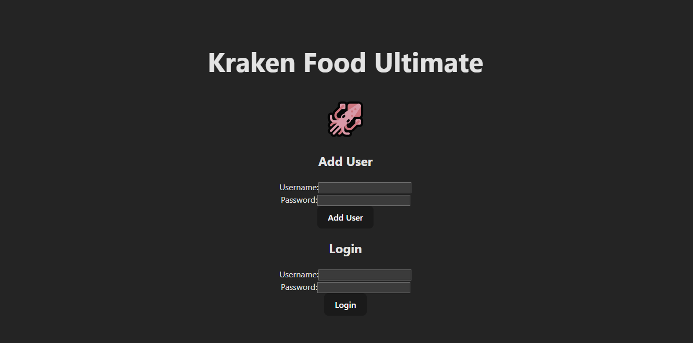
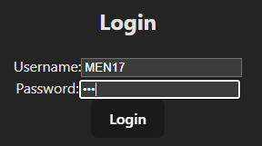
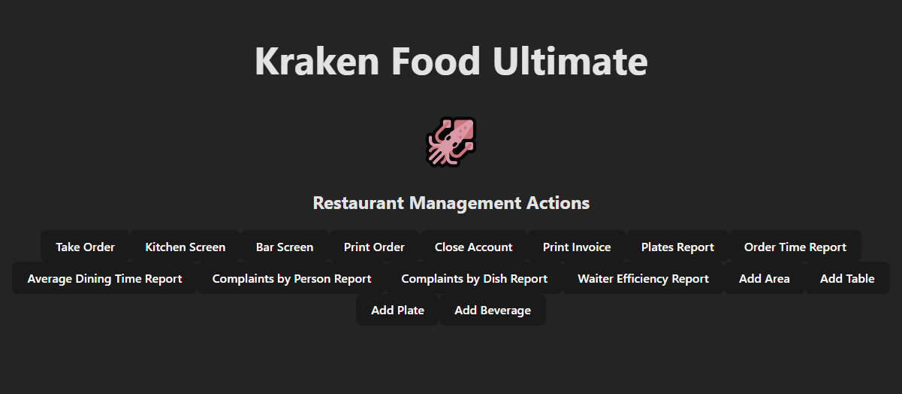
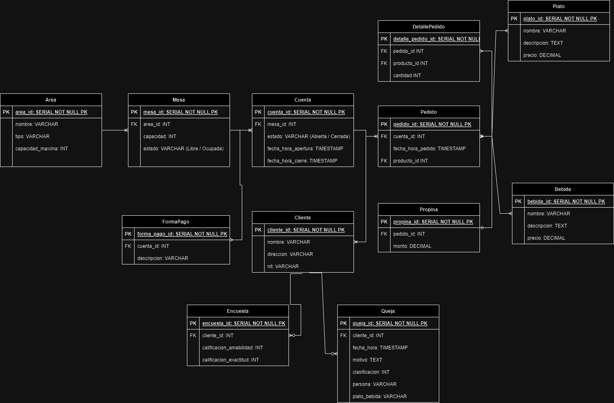
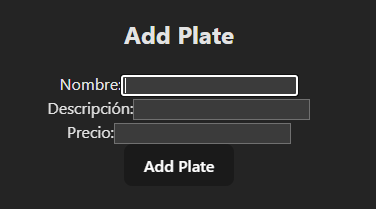

# KrakenFoodUltimate
Restaurant Administration Web Application

# Descripción:
Proyecto hecho en solitario cómo proyecto 2

# Tecnologías:
Frontend: Vite
Backend: ExpresJS y Postgresql

Kraken Food es una plataforma de gestión y análisis de restaurantes diseñada para optimizar tus operaciones y mejorar la experiencia del cliente. Utiliza las tecnologías de Vite y Postgresql para ofrecer una solución integral y eficiente.

Creado por: Menéndez Guerra

# Página de LogIn

# Guardado de contraseña encriptado

# Página Principal

# Diseño de Base de datos

# Adición de platillos

# Visualización de lo ingresado en postgresql

